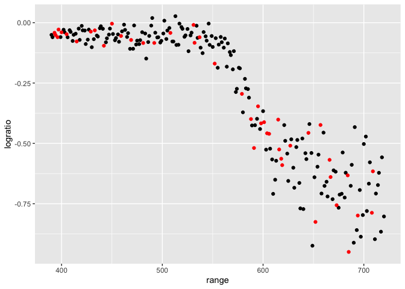
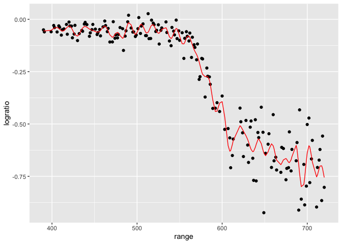
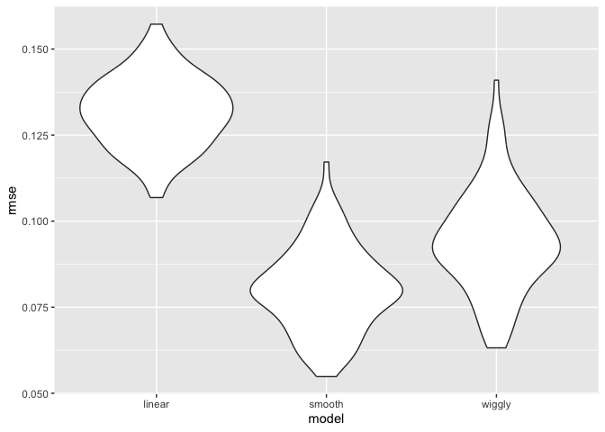
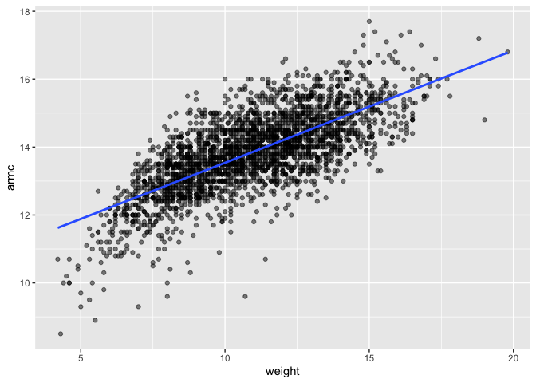
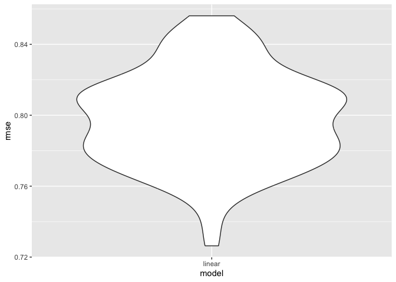

cross_validation
================

``` r
library(tidyverse)
```

    ## ── Attaching core tidyverse packages ──────────────────────── tidyverse 2.0.0 ──
    ## ✔ dplyr     1.1.4     ✔ readr     2.1.5
    ## ✔ forcats   1.0.0     ✔ stringr   1.5.1
    ## ✔ ggplot2   3.5.2     ✔ tibble    3.3.0
    ## ✔ lubridate 1.9.4     ✔ tidyr     1.3.1
    ## ✔ purrr     1.1.0     
    ## ── Conflicts ────────────────────────────────────────── tidyverse_conflicts() ──
    ## ✖ dplyr::filter() masks stats::filter()
    ## ✖ dplyr::lag()    masks stats::lag()
    ## ℹ Use the conflicted package (<http://conflicted.r-lib.org/>) to force all conflicts to become errors

``` r
library(modelr)
library(mgcv)
```

    ## Loading required package: nlme
    ## 
    ## Attaching package: 'nlme'
    ## 
    ## The following object is masked from 'package:dplyr':
    ## 
    ##     collapse
    ## 
    ## This is mgcv 1.9-3. For overview type 'help("mgcv-package")'.

``` r
library(p8105.datasets)
set.seed(1)
```

Load the LIDAR

``` r
data("lidar")
```

``` r
lidar
```

    ## # A tibble: 221 × 2
    ##    range logratio
    ##    <dbl>    <dbl>
    ##  1   390  -0.0504
    ##  2   391  -0.0601
    ##  3   393  -0.0419
    ##  4   394  -0.0510
    ##  5   396  -0.0599
    ##  6   397  -0.0284
    ##  7   399  -0.0596
    ##  8   400  -0.0399
    ##  9   402  -0.0294
    ## 10   403  -0.0395
    ## # ℹ 211 more rows

``` r
lidar_df =
  lidar |>
  mutate(id = row_number())

lidar_df |>
  ggplot(aes(x = range, y= logratio)) +
  geom_point()
```

<!-- -->

## Create dataframes

``` r
train_df = sample_frac(lidar_df, size = .8) |>
  arrange(id)

test_df = anti_join(lidar_df, train_df, by="id") #anti_join: Give me everything in the larger dataset and not in the smaller dataset
```

Look at these

``` r
ggplot(train_df, aes(x = range, y= logratio))+
  geom_point() +
  geom_point(data = test_df, color = "red") #Took original dataset and split it into two and graphed one ontop of the other.
```

<!-- -->

Fit a few models to ‘train_df’

``` r
linear_mod = lm(logratio ~ range, data = train_df) # Linear fit
smooth_mod = mgcv::gam(logratio ~ s(range), data = train_df) # Fitting anything that's not linear(use gam)
wiggly_mod = mgcv::gam(logratio ~ s(range, k = 50), sp = 10e-8, data = train_df) # Too show more noise in the line of best fit
```

Look at this

``` r
train_df |>
  add_predictions(wiggly_mod) |> 
  ggplot(aes(x = range, y = logratio)) +
  geom_point() +
  geom_line(aes(y = pred), color = "red")
```

<!-- -->

Try computing our RMSEs

``` r
rmse(linear_mod, test_df) # Not enough
```

    ## [1] 0.127317

``` r
rmse(smooth_mod, test_df) # Best fit
```

    ## [1] 0.08302008

``` r
rmse(wiggly_mod, test_df) # Too much
```

    ## [1] 0.0866401

## Iterate!

``` r
cv_df = 
  crossv_mc(lidar_df, n = 100) |> # Telling it how many times to do a random splot of the dataset
  mutate(
    train = map(train, as_tibble),
    test = map(test, as_tibble)
  )
```

Did this work? Yes!

``` r
cv_df |> pull(train) |> nth(2) #pull out each testing split
```

    ## # A tibble: 176 × 3
    ##    range logratio    id
    ##    <dbl>    <dbl> <int>
    ##  1   390  -0.0504     1
    ##  2   393  -0.0419     3
    ##  3   394  -0.0510     4
    ##  4   396  -0.0599     5
    ##  5   397  -0.0284     6
    ##  6   399  -0.0596     7
    ##  7   400  -0.0399     8
    ##  8   402  -0.0294     9
    ##  9   403  -0.0395    10
    ## 10   405  -0.0476    11
    ## # ℹ 166 more rows

Let’s fit models over and over.

``` r
cv_df_rmse <- cv_df |>
  mutate( # Create an anonymous function to do what I want a bunch of times
    linear_fits = map(train, \(df) lm(logratio ~ range, data = df)),
    smooth_fits = map(train, \(df) mgcv::gam(logratio ~ s(range), data = df)),
    wiggly_fits = map(train, \(df) mgcv::gam(logratio ~ s(range, k = 50), sp = 10e-8, data = df))
  ) |>
  mutate(
    rmse_linear = map2_dbl(linear_fits, test, rmse),
    rmse_smooth = map2_dbl(smooth_fits, test, rmse),
    rmse_wiggly = map2_dbl(wiggly_fits, test, rmse)
  )
```

Let’s try this better

``` r
cv_df_rmse |>
  select(starts_with("rmse")) |>
  pivot_longer(
    everything(),
    names_to = "model",
    values_to = "rmse",
    names_prefix = "rmse_"
  ) |>
  ggplot(aes(x = model, y = rmse)) +
  geom_violin()
```

<!-- -->

\#Child Growth

``` r
growth_df =
  read_csv("/Users/jaiawingard/Desktop/Data Science/linear_models/nepalese_children.csv")
```

    ## Rows: 2705 Columns: 5
    ## ── Column specification ────────────────────────────────────────────────────────
    ## Delimiter: ","
    ## dbl (5): age, sex, weight, height, armc
    ## 
    ## ℹ Use `spec()` to retrieve the full column specification for this data.
    ## ℹ Specify the column types or set `show_col_types = FALSE` to quiet this message.

Weight v arm_c

``` r
growth_df |>
  ggplot(aes(x = weight, y = armc)) +
  geom_point(alpha = 0.5)
```

<!-- -->

Let’s show the models we might use.

``` r
growth_df <- growth_df |>
  mutate(
    weight_cp7 = (weight > 7) * (weight - 7)
  )

linear_mod <- lm(armc ~ weight, data = growth_df)

growth_df |>
  ggplot(aes(x = weight, y = armc)) +
  geom_point(alpha = 0.5) +
  geom_smooth(method = "lm", se = FALSE)
```

    ## `geom_smooth()` using formula = 'y ~ x'

<!-- -->

Let’s fit three models

``` r
linear_mod = lm(armc ~ weight, data = growth_df)
pwl_mod = lm(armc ~ weight + weight_cp7, data = growth_df)
smooth_mod = mgcv::gam(armc ~ s(weight), data = growth_df)
```

``` r
growth_df |>
  add_predictions(linear_mod) |>
  ggplot(aes(x = weight, y = armc)) +
  geom_point(alpha = .5) +
  geom_line(aes(y=pred), color = "red")
```

<!-- -->

Now cross validate

``` r
cv_df = 
  crossv_mc(growth_df, n=100) |>
  mutate(
    train = map(train, as_tibble),
    test = map(test, as_tibble)
  )
```

``` r
cv_df =
  cv_df |>
  mutate(
    linear_mod = map(train, \(df) lm(armc ~ weight, data = df))
  ) |>
  mutate(
    rmse_linear = map2_dbl(linear_mod, test, rmse)
  )
```

Create boxplots

``` r
cv_df |>
  select(starts_with("rmse")) |>
  pivot_longer(
    everything(),
    names_to = "model",
    values_to = "rmse",
    names_prefix = "rmse_"
  ) |>
  ggplot(aes(x = model, y= rmse)) +
  geom_violin()
```

<!-- -->
